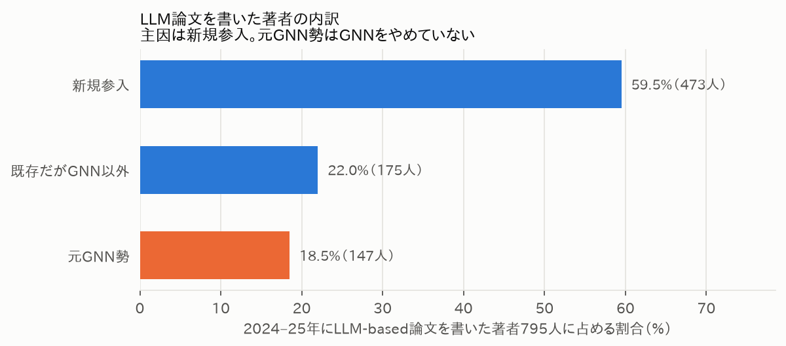

# 社会人になっても専門分野を追い続けられる時代になっていた — AIエージェントと論文2,108本を数えた話

自分が昔やっていた研究分野、いまどうなってるんだろうと思ったことはないだろうか。

僕は2019〜2021年、大学でレコメンドシステムの研究をしていた（グラフ構造を使った研究者推薦を、ランダムウォークで解く手法。GNNではなく古典的なグラフアルゴリズムのほう）。就職してデータアナリストになり研究とは縁のない生活を送っていたが、生成AI以降、ふとこの問いが浮かぶようになった。どの分野も構造が変わっていておかしくない時期だと思う。

ただ、ちゃんと調べるには時間がいる。うちには1歳と0歳の子どもがいて、平日にPCへ向かえる時間はほぼゼロだ。「きっとLLMばっかりになったのでは？」で終わらせていた。

---

## そこで、AIエージェントにサーベイの作業自体をやらせてみた

DBLPから6会議（RecSys / SIGIR / KDD / WWW / WSDM / CIKM）の2019〜2025年の採択論文2,108本をトピック分類、arXivのプレプリント7,740本も同様に分類、著者IDで年をまたいだ追跡も実施。

これをAIエージェントと対話しながら実行。データ取得・分類・集計・作図・レポート化までリポジトリごと組んでもらった。

最初のアイデア出しやレポートの構成は、家事や育児の合間の隙間時間にスマホからClaude Codeに指示を出して進めた。

分析自体は、週末に子どもが昼寝している2〜3時間で完了。（学生時代に一人でやったら数週間はかかっていたと思う。。）

もちろん分類はタイトルのみに基づく限界もある（詳細は技術版に記載）。AIエージェントは万能ではないが、「検証込みで速くできる」のは実感した。

> 🔗 分析リポジトリ: https://github.com/kanta-nakamura-biz/recsys-trend-survey
> 🔗 技術版（Zenn）: （Zenn公開後に記入）

---

## 結果として、僕がいた分野に何が起きていたか

てっきり「グラフ系は終わって、みんなLLMに移った」というオチだろうと思っていた。数えてみたら、全然違った。

まず驚いたのが変化のタイミングだ。LLM関連の論文は2023年時点でまだ2.2%しかなかったのに、2024年に17.8%へ跳ね上がる。ChatGPT公開（2022年11月）から会議録に反映されるまで約1年半かかった計算だ。

そして僕がいた「グラフ」の括りのシェアも、まさに同じ2024年に19〜23%台から14.0%へ急落していた。じわじわ衰退したのではなく、この1年で入れ替わっている。

トピック別の論文シェア推移
左上がLLM、右下がグラフ系のトピック

じゃあ、GNNをやっていた人たちがそのままLLMに乗り換えたのか。著者IDで追跡してみると、答えはNoに近かった。

2024〜25年にLLM論文を書いた795人のうち、59.5%はそれ以前この6会議に一度も論文を出していない新規参入者だった。GNNからの乗り換え組（18.5%）よりずっと多い。しかも元GNN勢は、GNNを書くのをやめてすらいない。

LLM論文を書いた著者795人の内訳
主因は新規参入で、元GNN勢はGNNをやめていない

決定打は実数だった。シェアで見るとGNNは5.2ポイント落ちているのに、本数は141本から189本に増えていた。8トピック全部が実数では増えている。推薦論文全体が1.76倍に膨らんだせいで、相対的に伸びが遅いテーマが「減った」ように見えていただけだった。

トピックごとのシェア変化（2019–21年→2023–25年）
Graph / GNNの落ち込みが目立つが、本数は実は増えている

つまり、誰もグラフ研究をやめていない。LLMという新しい人口が大量に流入して全体のパイが膨らんだ結果、古いテーマの取り分が相対的に縮んだだけだ。

> レコメンド研究がLLM一色になったわけじゃなく、むしろLLMの台頭が既存テーマを置き換えずに研究全体を加速させた、というのが実態に近い。

---

## この話、自分の専門分野だけじゃないと思う

「自分がいた分野、今どうなってるんだろう」という好奇心は誰にでもある。これまでネックだった「時間さえあれば」が、AIエージェントのおかげでかなり低い壁になった。

気になる分野がある人は、まとまった時間がなくても一度試してみてほしい。自分の専門分野で試した結果もぜひ教えてほしい。

---

*本記事の分析は個人による調査であり、所属組織とは無関係です。*
