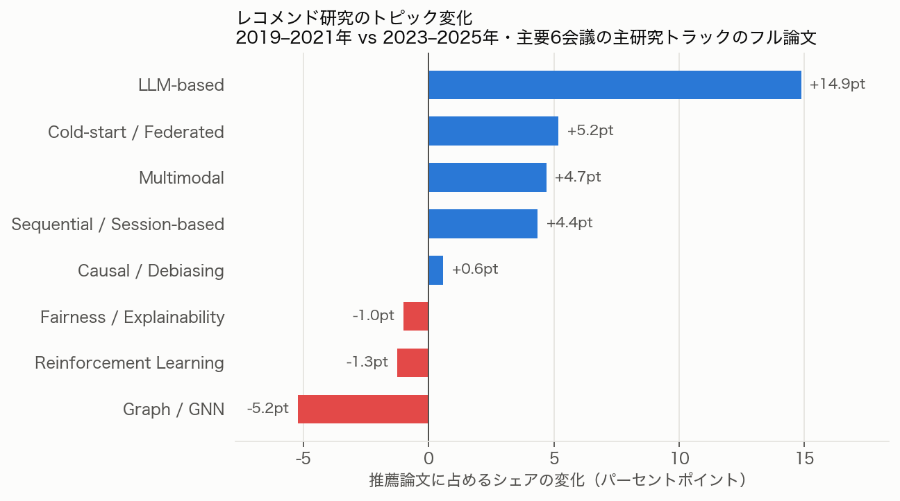
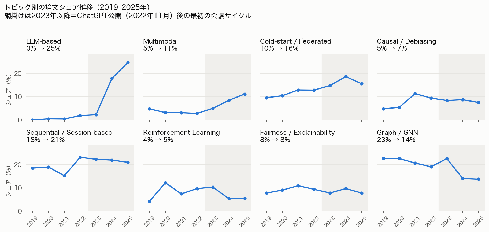
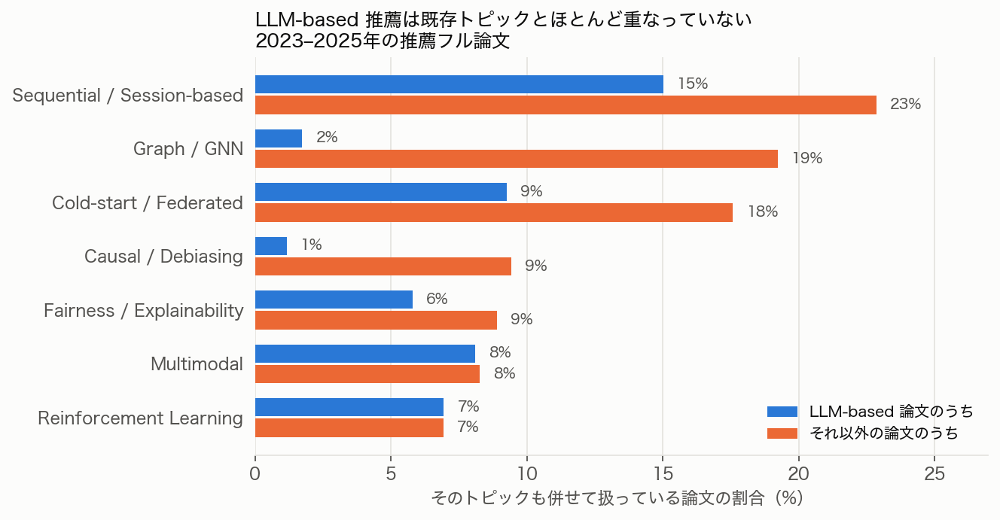
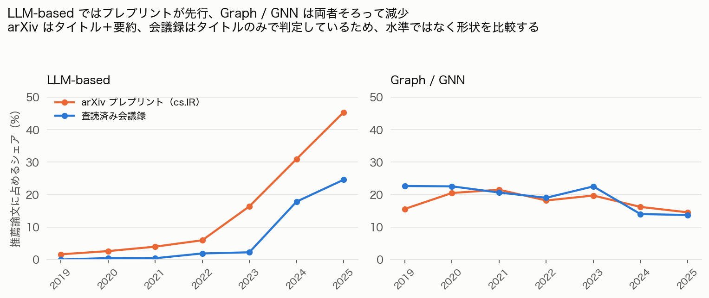

# レコメンド研究の潮流は7年で何が変わったか — 主要6会議の論文2,108本を数えた

## この記事について

2019年から2021年にかけて、私は大学でレコメンドシステムの研究をしていた。
当時のトップ会議は、グラフニューラルネットワーク、系列推薦、因果推論・debiasing、
公平性といったテーマが多かった。その後就職し、生成AIが来た。

いま研究の潮流はどう変わったのか。これを印象論ではなく数字で確かめたくなり、
DBLP から主要6会議（RecSys / SIGIR / KDD / WWW / WSDM / CIKM）の
2019年から2025年までの採択論文を集め、推薦関連のフル論文 2,108 本を
トピック別に分類して集計した。arXiv のプレプリント 7,740 本も補助的に見ている。

分析スクリプトと集計結果、および判定の全件一覧は GitHub で公開している。

> 🔗 リポジトリ: https://github.com/kanta-nakamura-biz/recsys-trend-survey

念のため書いておくと、レコメンド研究の潮流をまとめたサーベイ論文自体は
すでにいくつも存在する。学術的な新規性をここで主張するつもりはない
（そこは目をつぶってほしい）。あくまで、自分の目で2019〜2025年の
実データを取得・検証し、印象論ではなく手を動かして確かめてみた、
という個人の調査として読んでもらえればと思う。

---

## 数字を出す前に：何を数えて、何を数えていないか

結論から見たくなるところだが、この手の集計は「何を数えたか」で結論が
いくらでも動く。先に開示しておく。

数えたものは、6会議の主研究トラックのフル論文のみ。
デモ、チュートリアル、Doctoral Symposium、産業界トラック、
Resource / Reproducibility トラックは分けて除外した。
RecSys 以外の5会議からは、タイトルに推薦関連語を含む論文だけを抜き出している。

すべて比率で見ている。これは重要で、会議の採択数自体が
この期間に大きく増えているからだ。KDD のフル論文は 2019 年の 174 本から
2025 年には 551 本になっている。件数だけを見れば「どのテーマも伸びている」
という誤った絵が描けてしまう。

検証したことは、抽出したフル論文数を各会議の公表採択数と突き合わせる作業。
SIGIR 2019年=84本、2020年=147本、2021年=151本、WWW 2019年=225本、
RecSys 2019年=36本は公表値と完全に一致した。
一致しない年（RecSys 2023・2024）もあり、原因は特定できたので、
その会議を除外した集計も出して結論が変わらないことを確認している
（変わらなかった。むしろ Graph / GNN の減少は大きくなる）。

限界もある。DBLP はアブストラクトを持たないので、分類はタイトルのみで
行っている。本文で扱っていてもタイトルに書かれていない主題は取りこぼす。
また、キーワード辞書は新しい語彙（`LLM`, `prompt`）を拾いやすく、
同じ概念を古い言葉で書いた論文を取りこぼしやすい。
増えている軸は多めに、減っている軸は少なめに出るバイアスが
構造的にあるので、その点は割り引いて読んでほしい。

分類はキーワード辞書による一次分類（1,228本）と、
残り 880 本を LLM に読ませたラベリングのハイブリッドで行った。
LLM が付けたラベルはそのままファイルとしてリポジトリに入れてあるので、
API キーがなくても誰でも同じ集計を再現できる。

---

## 結果1：7年で何が増え、何が減ったか

| トピック | 2019–2021 | 2023–2025 | 変化 |
|---|---:|---:|---:|
| LLM-based | 0.3% | 15.2% | **+14.9pt** |
| Cold-start / Federated | 11.1% | 16.3% | +5.2pt |
| Multimodal | 3.6% | 8.3% | +4.7pt |
| Sequential / Session-based | 17.3% | 21.7% | +4.4pt |
| Causal / Debiasing | 7.6% | 8.2% | +0.6pt |
| Fairness / Explainability | 9.4% | 8.4% | −1.0pt |
| Reinforcement Learning | 8.2% | 6.9% | −1.3pt |
| Graph / GNN | 21.8% | 16.6% | **−5.2pt** |

（1本の論文が複数の軸に属することを許しているので、合計は100%を超える）

わかりやすい絵ではある。LLM が跳ね、グラフが落ちた。
ただ、期間平均は変化がいつ起きたかを隠してしまう。
そこが今回いちばん面白かったところだった。

---

## 結果2：分岐点は2023年ではなく、2024年だった

年ごとに並べると、話がはっきりする。

LLM 論文は2024年に不連続に立ち上がっている。
2023年時点ではまだ 2.2% にすぎない。それが2024年に 17.8%、2025年に 24.5% になる。
ChatGPT の公開は2022年11月なので、査読済み会議録に現れるまでに
およそ1年半かかったことになる。投稿締切、査読、開催というサイクルを
1周する分だけ、研究の主題転換は遅れて可視化される。

興味深いのは、Graph / GNN の減少も同じ2024年に起きていることだ。
2019年から2023年までは 19〜23% で安定しており、2023年はむしろ 22.5% と高い。
それが2024年に 14.0% へ急落する。
つまり Graph / GNN 研究は徐々に衰退したのではなく、
LLM が立ち上がったのと同じ年に反転している。

一方で、7年間ほとんど動かなかった軸もある。
Fairness / Explainability は 8〜11% のレンジをずっと横ばい、
Reinforcement Learning も同様だった。
Causal / Debiasing は2021年に 11.3% でピークを打ち、以後 7〜9% で推移している。
期間平均だけ見ると「ほぼ変化なし（+0.6pt）」に見えるが、
実際には2021年の山を挟んだ緩やかな減衰である。

---

## 結果3：LLM は他のテーマを「吸収」したのか

これが個人的にいちばん確かめたかった問いだった。
LLM-based の推薦は、既存の Graph / GNN や Sequential を飲み込んで発展しているのか、
それとも別のものとして並走しているのか。

答えは、どちらでもなく、ほぼ独立していた。

2023–2025年の推薦フル論文1,140本のうち、LLM 論文は173本。
この173本が他の軸をどれだけ併せて扱っているかを見ると：

| | LLM 論文 | それ以外の論文 |
|---|---:|---:|
| Graph / GNN も扱う | 1.7% | 19.2% |
| Causal / Debiasing も扱う | 1.2% | 9.4% |
| Sequential も扱う | 15.0% | 22.9% |
| 他の7軸をひとつも扱わない | **58.4%** | 20.6% |

LLM 論文の6割近くが、既存7軸のいずれにも触れずに独立した主題として
書かれている。とくにグラフとの共起は 1.7% で、
それ以外の論文の 19.2% に対して一桁少ない。

融合ではなく、置き換えに近い。実際に人が動いたのかは §著者分析で確かめる。

（ただしタイトルベースの判定なので、LLM と GNN を組み合わせた論文が
タイトルには LLM 側しか書かない、という可能性は排除できない。
それでも 1.7% と 19.2% の差は、その効果だけで説明するには大きいと思う）

---

## 結果4：プレプリントは会議より1年以上先を走っている

arXiv の cs.IR に投稿された推薦関連プレプリント7,740本を同じ方法で分類すると、
会議録より一貫して先行していた。

LLM 関連は、会議録が 2.2% だった2023年の時点で、プレプリントでは既に16%。
そして2026年（8月まで）は 55% に達している。
いま arXiv に出ている推薦研究のプレプリントの半数以上が LLM 関連だ。

Graph / GNN は逆方向で、プレプリントでは2021年をピークに一貫して減り続けている。
会議録側の減少は、この動きを2〜3年遅れて追いかけた形になる。

そしてもうひとつ、Multimodal がプレプリント側で加速している。
LLM に次ぐ増加軸で、会議録にはまだ一部しか現れていない。
次に会議録で目立ってくるのはこの領域かもしれない。

---

## 著者を追う：GNN の人は LLM に移ったのか

LLM の立ち上がりと Graph / GNN の反転が同じ2024年だったので、
人が流れた可能性がある。DBLP の著者 pid を使って同一著者を年をまたいで追った。

結論から言うと、移動はしている。ただし主因ではない。

| 2019–23年の群 | 2024–25も活動 | うち LLM 論文 | 割合 |
|---|---:|---:|---:|
| Graph / GNN 論文あり | 352人 | 147人 | 41.8% |
| Graph / GNN 論文なし | 540人 | 175人 | 32.4% |

元 GNN 勢のほうが LLM を書く率は高いが、差は9.4ptにとどまる。
主因は別のところにあった。新規参入である。

| 2024–25年の LLM 著者795人の出自 | 人数 | 割合 |
|---|---:|---:|
| 新規参入（2019–23年に本データで論文なし） | 473 | 59.5% |
| 既存だが GNN 以外 | 175 | 22.0% |
| 元 GNN 勢 | 147 | 18.5% |

LLM 論文の著者の6割は、2019–23年にこの6会議で論文を書いていない。

しかも元 GNN 勢は GNN を捨てていない。

| トピック | 元GNN勢の24–25論文 | 24–25全体 | 差 |
|---|---:|---:|---:|
| LLM-based | 27.0% | 24.1% | +2.9 |
| Graph / GNN | 15.4% | 12.8% | +2.6 |

全体平均より LLM を書きつつ、Graph / GNN も全体平均より書いている。
乗り換えではなく上乗せに近い。

限界として、本データの6会議でしか著者を追えないため、「新規参入」には
他分野からの流入と、単に別会議で活動していた著者の両方が含まれる。

---

## 実数で見る：減ったトピックはひとつも無い

| トピック | 2019–21 | 2023–25 | 倍率 |
|---|---:|---:|---:|
| LLM-based | 2 | 173 | **86.5倍** |
| Multimodal | 23 | 94 | 4.09倍 |
| Cold-start / Federated | 72 | 186 | 2.58倍 |
| Sequential / Session-based | 112 | 247 | 2.21倍 |
| Causal / Debiasing | 49 | 93 | 1.90倍 |
| Fairness / Explainability | 61 | 96 | 1.57倍 |
| Reinforcement Learning | 53 | 79 | 1.49倍 |
| Graph / GNN | 141 | 189 | **1.34倍** |
| （推薦論文計） | 647 | 1,140 | 1.76倍 |

8軸すべてが実数では増えている。推薦論文の総数が1.76倍になったので、
それより伸びが遅かった軸がシェアを落とした。
Graph / GNN の −5.2pt は縮小ではなく減速である。

ただし年次では、Graph / GNN は2023年の81本をピークに
2024年55本、2025年53本と直近2年は実数でも減っている。

---

## まとめ

シェアの増減と実数の増減が逆方向を向いていたのが、今回の一番の収穫だった。
Graph / GNN は5.2pt落ちているのに本数は増えている。LLM の急伸も、既存著者の
乗り換えではなく新規参入が主因だった。論文の増減は研究コミュニティの関心の
配分であって、実務での価値の増減ではない。

集計スクリプト、判定の全件一覧、限界の詳細は GitHub に置いてある。
分類の妥当性を確認したい方は `reports/classification_audit.md` を見てほしい。

> 🔗 リポジトリ: https://github.com/kanta-nakamura-biz/recsys-trend-survey

---

*本記事の分析は個人による調査であり、所属組織とは無関係です。
トピック分類はキーワード辞書と LLM による自動判定を含み、
個々の論文のラベルが常に正しいことを保証するものではありません。*
