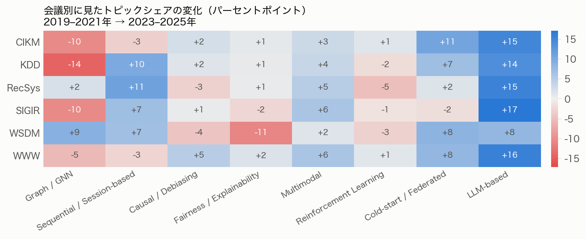
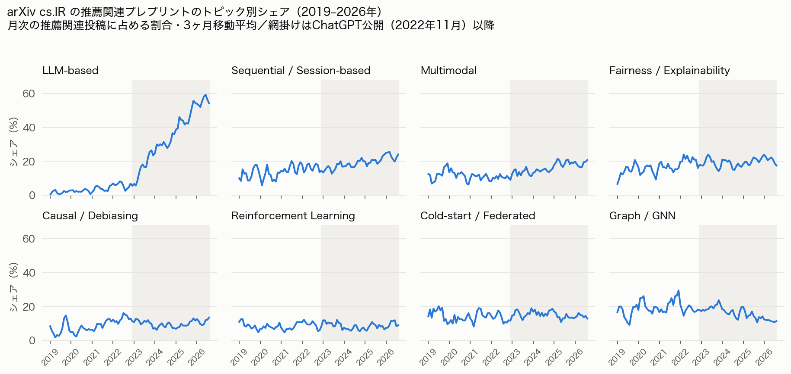

# レコメンドシステム研究の潮流変化：2019–2021 と 2023–2025 の比較

**集計日**: 2026-08-22 ／ **データソース**: DBLP（査読済み会議録）, arXiv API（cs.IR）

本レポートは note 記事の土台となる事実整理である。数値の解釈と、その解釈が
妥当かどうかを検証できるだけの手続き・限界を記述することを目的とする。

---

## 1. 何を数えたか

### 1.1 対象

| 項目 | 内容 |
|---|---|
| 会議 | RecSys, SIGIR, KDD, WWW, WSDM, CIKM |
| 年 | 2019–2025（連続 7 年） |
| 対象論文 | 各会議の**主研究トラックのフル論文**のみ |
| 比較の主軸 | 2019–2021 vs 2023–2025（各 3 年） |
| 2022 の扱い | 年次推移には含めるが、期間比較からは除外 |

2022 を期間比較から外したのは、ChatGPT 公開（2022-11）が 2022 年の会議投稿締切の
**後**であり、2022 年は「生成AI以前の最後の年」と「以後の最初の年」のどちらとも
言い切れない移行期にあたるためである。両区間を 3 年ずつに揃える目的も兼ねる。

### 1.2 件数

| 段階 | 件数 |
|---|---|
| DBLP 目次から抽出した全エントリ | 16,087 |
| うち主研究トラックのフル論文 | 8,893 |
| うち推薦関連（**本レポートの分析対象**） | 2,108 |
| ├ 2019–2021 | 647 |
| ├ 2022 | 321 |
| └ 2023–2025 | 1,140 |

論文数そのものは会議規模の拡大に強く引きずられる（例：KDD のフル論文は 2019 年
174 件 → 2025 年 551 件）。したがって本レポートの指標は**すべて「その年・その期間の
推薦関連フル論文に占める割合」**であり、件数の増減をトレンドと読まない。

### 1.3 トラックの切り出し

DBLP の会議目次 XML は `<h2>` にセッション見出しを持つ。この見出しを各論文に
付与し、以下の順で分類した（`config/tracks.yaml`、全判定結果は
[`track_mapping.md`](track_mapping.md)）。

1. デモ・チュートリアル・ワークショップ・Doctoral Symposium・招待講演などを除外
2. 産業界トラック（KDD ADS、CIKM Applied Research、SIGIR SIRIP 等）を分離
3. Resource / Reproducibility / Dataset など別枠の査読トラックを分離
4. 見出しが `Short` / `Full` / `Long` / `Research Track` を明示していればそれに従う
5. 見出しが主題別セッション名（例：`Sequential Recommendation`）で判定材料に
   ならない場合のみ、**ページ数**で判定（8 ページ以上をフル論文、WWW のみ 9 ページ）

見出しだけでは判定できない実例があるためこの併用が必要だった。WSDM の
`Poster Session` は 9 ページ＝実質フル論文であり、見出しの "Poster" で短編と
みなすと誤る。逆に SIGIR には 8–9 ページの `Short Research Papers` が存在するため、
ページ数だけでも誤る。

**検証**: 抽出したフル論文数を各会議の公表採択数と突き合わせた。
SIGIR 2019 = 84、SIGIR 2020 = 147、SIGIR 2021 = 151、WWW 2019 = 225、
RecSys 2019 = 36 は公表値と**完全に一致**する。

ただし RecSys については公式の投稿統計が全年分あるので突き合わせたところ、
一致しない年がある（`data/processed/recsys_count_check.csv`）。

| 年 | 公表 long papers | 本集計の full | 差 | 別枠にした Reproducibility |
|---:|---:|---:|---:|---:|
| 2019 | 36 | 36 | 0 | 0 |
| 2020 | 39 | 41 | +2 | 0 |
| 2021 | 49 | 48 | −1 | 3 |
| 2022 | 39 | 39 | 0 | 3 |
| 2023 | 47 | **53** | **+6** | 0 |
| 2024 | 58 | **71** | **+13** | 0 |
| 2025 | 49 | 48 | −1 | 22 |

差が大きい 2023・2024 は、**DBLP に Reproducibility の独立見出しが無い年と
完全に一致する**。2021・2022・2025 では独立見出しがあるため別枠に分離できて
いるが、2023・2024 は再現性論文が主題別セッションに混ざっており、フル論文と
して数えられている。±1〜2 の年は DBLP の収録単位と公表統計の数え方の差と
みられる。この影響が結論を動かしていないかは §2.6 で確認する。

### 1.4 推薦関連論文の抽出

RecSys は会議全体が推薦研究なので全件を対象とした。他の 5 会議はタイトルに
推薦関連語（`recommend*`, `collaborative filtering`, `CTR`, `personaliz*`,
`cold-start`, `next-item` など、`config/recsys_filter.yaml`）を含むものを抽出した。

この語彙は意図的に**高精度・中再現率**に振ってある。`unbiased learning to rank` や
広告配信の一部など、情報検索と推薦の境界にある論文は取りこぼす。境界事例は
[`recsys_filter_audit.md`](recsys_filter_audit.md) に標本を出力してある。

重要なのは、**この抽出語彙がトピック軸のどれとも相関しないよう選んである**こと
である。もし `debias` のような語をフィルタに入れていれば、因果推論軸のシェアが
自動的に押し上げられてしまう。

### 1.5 トピック分類

8 軸のマルチラベル分類（1 論文が複数軸に属してよい）。

- **一次分類**: `config/topics.yaml` のキーワード正規表現（2,108 件中 1,228 件）
- **二次分類**: 一次で拾えなかった 880 件を LLM（Claude Opus 5）が読んでラベル付け
  （うち 411 件が 1 軸以上に該当、469 件はいずれにも該当せず）

LLM のラベル結果は [`../labels/llm_labels.jsonl`](../labels/llm_labels.jsonl) として
リポジトリに含めてあるため、**API キーがなくても第三者が同じ集計を再現できる**。

マルチラベルであるため、軸ごとのシェアの合計は 100% を超える。分類の妥当性は
各軸から無作為 20 件を抽出した [`classification_audit.md`](classification_audit.md)
で確認できる。

---

## 2. 結果

### 2.1 期間比較：何が増え、何が減ったか

| トピック | 2019–2021 | 2023–2025 | 変化 |
|---|---:|---:|---:|
| LLM-based | 0.31% | 15.18% | **+14.9pt** |
| Cold-start / Federated | 11.13% | 16.32% | +5.2pt |
| Multimodal | 3.55% | 8.25% | +4.7pt |
| Sequential / Session-based | 17.31% | 21.67% | +4.4pt |
| Causal / Debiasing | 7.57% | 8.16% | +0.6pt |
| Fairness / Explainability | 9.43% | 8.42% | −1.0pt |
| Reinforcement Learning | 8.19% | 6.93% | −1.3pt |
| Graph / GNN | 21.79% | 16.58% | **−5.2pt** |

### 2.2 年次推移：変化はいつ起きたか

期間平均が隠してしまう情報がここにある。

- **LLM-based は 2024 年に不連続に立ち上がった**。2023 年時点ではまだ 2.2% であり、
  2024 年に 17.8%、2025 年に 24.5% となる。ChatGPT 公開（2022-11）から会議録に
  現れるまで**およそ 1 年半**かかっている。研究の主題転換は査読サイクル 1 周分
  遅れて可視化される。
- **Graph / GNN の減少も 2024 年に起きている**。2019–2023 は 19–23% で安定して
  おり（2023 年は 22.5% とむしろ高い）、2024 年に 14.0% へ急落した。
  つまり緩やかな衰退ではなく、**LLM が立ち上がったのと同じ年に起きた反転**である。
- **Causal / Debiasing は 2021 年に 11.3% でピークを打ち、以後 7–9% で横ばい**。
  期間平均で見ると「ほぼ変化なし（+0.6pt）」だが、実際には
  2021 年の山を挟んだ緩やかな減衰である。
- **Fairness / Explainability と Reinforcement Learning は 7 年間ほぼ横ばい**。

### 2.3 会議ごとの違い

LLM-based の増加はすべての会議で共通（+8〜+17pt）だが、Graph / GNN の減少は一様ではない。
CIKM（−10）、KDD（−14）、SIGIR（−10）、WWW（−5）で減る一方、**WSDM は +9、
RecSys は +2 とむしろ増えている**。グラフ研究が特に厚かった会議ほど大きく
減っており、会議固有の構成比の変化という側面がある。

### 2.4 LLM は他のトピックを吸収したのか

当初の問いは「LLM-based recommendation が他のトピックをどう吸収・共存して
いるか」だった。データが示す答えは**どちらでもなく、ほぼ独立している**である。

2023–2025 の推薦フル論文 1,140 件（LLM 173 件、非LLM 967 件）について：

| | LLM 論文 | 非LLM 論文 |
|---|---:|---:|
| Graph / GNN も扱う | 1.7% | 19.2% |
| Causal / Debiasing も扱う | 1.2% | 9.4% |
| Sequential も扱う | 15.0% | 22.9% |
| **他 7 軸をひとつも扱わない** | **58.4%** | 20.6% |
| 併記軸数の平均 | 0.48 | 0.93 |

LLM 論文の 6 割近くが、既存 7 軸のいずれにも触れずに独立した主題として書かれて
いる。とりわけグラフとの共起は 1.7% と、非LLM 論文の 19.2% に対して一桁少ない。
**融合ではなく置き換えに近い**構図である。

ただし、これはタイトルベースの判定である点に注意が必要である。LLM と GNN を
組み合わせた論文がタイトルには LLM 側しか書かない、という可能性は排除できない。
それでも 1.7% と 19.2% の開きは、その効果だけで説明するには大きい。

### 2.5 arXiv：会議録にまだ現れていない動き

cs.IR の推薦関連プレプリント 7,740 件（2019-01〜2026-08）。会議録と同じ
`topics.yaml` で分類したが、arXiv 側は**タイトル + アブストラクト**で判定して
いるため（DBLP はタイトルのみ）、シェアの水準は両者で比較できない。
比較してよいのは形状だけである。

頑健性確認として、arXiv をタイトルのみで判定した系列も出力しており
（`data/processed/arxiv_monthly_title_only.csv`）、**8 軸すべてで変化の向きは
一致**した。

- **LLM**: プレプリントは 2023 年に既に 16%（タイトルのみ判定でも 10%）に達して
  おり、会議録の 2.2% を大きく先行していた。2026 年（8 月まで）は 55%
  （タイトルのみ 37%）。**推薦研究のプレプリントの半数以上が LLM 関連**である。
- **Graph / GNN**: プレプリントでは 2021 年をピークに一貫して減少し、2026 年は
  タイトルのみ判定で 4.1%（2021 年の 12.6% から 1/3）。会議録の減少は
  この動きを 2〜3 年遅れて追っている。
- **Multimodal** はプレプリント側で加速している（2019 年 12% → 2026 年 18%)。
  会議録側（3.6% → 8.3%）と合わせて、**LLM に次ぐ増加軸**である。

### 2.6 感度分析：RecSys を除いても結論は変わらない

§1.3 のとおり RecSys 2023・2024 のフル論文数は公表値を上回る。
そこで RecSys を丸ごと除外して同じ集計を行った
（`data/processed/sensitivity_without_recsys.csv`）。

| トピック | 全会議 | RecSys 除外 |
|---|---:|---:|
| LLM-based | +14.9pt | +14.8pt |
| Cold-start / Federated | +5.2pt | +5.9pt |
| Multimodal | +4.6pt | +4.7pt |
| Sequential / Session-based | +4.4pt | +2.7pt |
| Causal / Debiasing | +0.6pt | +1.5pt |
| Fairness / Explainability | −1.0pt | −1.2pt |
| Reinforcement Learning | −1.3pt | −0.3pt |
| Graph / GNN | −5.2pt | **−7.4pt** |

**8 軸すべてで変化の向きが一致**する。Graph / GNN の減少はむしろ大きくなり
（−5.2pt → −7.4pt）、LLM-based の増加はほぼ同一（+14.9 → +14.8pt）。
順位が入れ替わるのは Reinforcement Learning と Fairness / Explainability の
2 軸だけで、いずれも −1pt 前後の小さな変化である。

主要な結論（LLM の急増、Graph の減少、Causal の横ばい）は
RecSys の数え方に依存していない。

---

## 3. 限界

数値を読むうえで、以下は必ず併記する必要がある。

1. **タイトルのみでの分類**（DBLP はアブストラクトを提供しない）。本文で扱って
   いてもタイトルに現れない主題は取りこぼす。§2.4 の共起分析はこの影響を最も
   受けやすい。
2. **キーワード辞書の時代バイアス**。新しい語彙（`LLM`, `prompt`）は拾いやすく、
   同じ概念を古い語彙で書いた論文は取りこぼしやすい。増加側の軸は過大に、
   減少側の軸は過小に出る方向のバイアスがある。
3. **トラック正規化の恣意性**。ページ数 8 という閾値、産業界トラックの除外、
   Resource / Reproducibility の分離はいずれも判断を含む。根拠は
   [`track_mapping.md`](track_mapping.md) に全件出してある。
4. **RecSys 2023・2024 の内訳が分離できない**（§1.3 で公表統計により確認済み）。
   2023 年は +6 件、2024 年は +13 件、公表 long papers より多く数えている。
   ただし §2.6 のとおり、RecSys を除外しても結論は変わらない。
5. **マルチラベルのためシェアの合計は 100% を超える**。軸間の大小比較は
   できるが、「全体の何割が何」という分割としては読めない。
6. **推薦関連フィルタの再現率**。情報検索と推薦の境界領域（unbiased LTR、
   広告配信）は意図的に落としている。特に Causal / Debiasing 軸は、
   IR 側の unbiased ranking 研究を含めれば数値が上振れする可能性がある。
7. **DBLP のインデックス遅延**と会議規模の変動。前者は 2025 年、後者は全期間に
   影響する。比率で扱うことで後者は緩和しているが、会議ごとの構成比変化
   （§2.3）は残る。
8. **arXiv と DBLP は判定に使うテキストが異なる**ため、水準の直接比較は不可。

---

## 4. レビューしていただきたい点

1. §2.2 の「LLM の立ち上がりと Graph の反転が同じ 2024 年に起きた」という読み方は
   妥当か。査読サイクルの遅れ以外に、会議側の要因（トラック新設、査読者構成の
   変化など）で説明できる部分はないか。
2. §2.4 の「LLM 研究は既存トピックと融合せず独立している」という解釈は、
   タイトルベースという制約を踏まえてどこまで主張してよいか。
3. §2.3 で WSDM・RecSys だけグラフが増えている点について、見落としている
   文脈はないか。
4. 8 軸の切り方（特に「コールドスタート」と「連合学習」を同一軸にしている点、
   および「公平性」と「説明可能性」を同一軸にしている点）に無理はないか。
5. 外部発信（note 記事）として出してよい粒度か。
